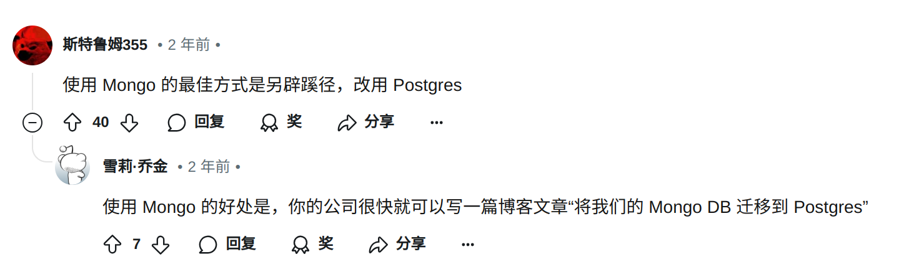

# 资产管理平台

> ⚠ 此项目暂停更新一段时间, 接下来将更新 https://github.com/creampnx-x/auto-fill

> 🖼 于241217重新开始更新。

## 平台架构

### 服务端

在服务端，我准备使用Rust来编写接口，并使用postgresQL来组织数据。

> ⚠ 本来我计划使用mongoDB 不过发现这家伙的生态、数据库架构很难在生产环境中应用。
> 
> 

> ⚠ 本来准备用 diesel 的，但是好难用，后面又替换成SQLx


### 网页端

> ⚠ 在前端，我原本准备使用Solidjs来编写UI界面, 由于生态原因，我不得不放弃使用solid.js。

在前端，我将使用react来开发前端界面。

#### front end log

1. framework: select `React`
2. build tool: select `Vite`
3. UI components libary:
    + most components from `shadcn/ui`
    + other intresting components from `magicUI`
4. for request: select `fetch`

#### 未来计划

+ 抽出一个管理系统框架
+ 抽出一个流程管理系统(AKA `OA`)


## 整体流程架构

### 数据流动

1. 用户访问前端 React
2. React 访问 Server Rocket
3. Rocket 访问 Postgres

### 开发流程

1. 先写静态前端页面
2. 通过前端编写后端接口
3. 访问数据库
4. 前端连接后端
5. 前端编译到后端静态文件中

```sh
# cargo test 控制台输出
cargo test -- --nocapture
```

> 本项目旨在尽可能的简单，并且清晰每个模块的功能。

### 合理的处理 panic

在项目中不能使用 `.expect`, `.unwrap`, `panic!()` 等函数来处理 `Result<_,_>`, `Option<_>` 这样的数据, 原因在于即便服务器会服务器会处理程序引发的恐慌, 并不会让程序退出且能够继续接受下一个请求, 然而事实的情况是, 服务器给前端发送状态码为`500`, 前端接收到的信息为`internal server error`, 前端接收到的信息为:
```html
<!DOCTYPE html>
<html lang="en">
<head>
    <meta charset="utf-8">
    <meta name="color-scheme" content="light dark">
    <title>500 Internal Server Error</title>
</head>
<body align="center">
    <div role="main" align="center">
        <h1>500: Internal Server Error</h1>
        <p>The server encountered an internal error while processing this request.</p>
        <hr />
    </div>
    <div role="contentinfo" align="center">
        <small>Rocket</small>
    </div>
</body>
</html>
```
服务器内部发生了什么? 哪里出错了? 是数据库连接出问题了吗? 是加密出错了吗?...没人知晓服务器中发生了什么, 甚至一个数据库出现的空值也会让服务器出现恐慌. 

幸好服务器会有log, 我们可以通过log得知具体的错误, 然而这并不是我们所设想的理想状态, 因为我们需要在第一时间了解错误, 并且进行及时区分, 有些是第三方的错误, 有些是用户可以解决的等等, 那么我学习到的一个比较清晰的使用恐慌的原则为 `需要程序员介入的时候再使用恐慌`.

这个原则似乎很清晰, 进一步思考一下: 什么情况下需要程序员介入, 即代码逻辑出错的时候, 这并非主观出错, 而是无意识的设计. 所以其实我们并不需要主动的去设计错误的抛出让整个接口 down 掉, 而是通过完整的类型检查/完备的code review/错误内部处理, 故而`不要在服务器代码中使用panic`.

### rocket jwt

rocket不需要jwt，因为其本身就可以提供加密过的`private_cookie`，这样将用户信息`json`直接编码到cookie中，不用再引入jwt了。

cookie 内容校验：

在获取`cookie`过程中进行多个错误判断即可验证结果。
+ `Rocket` 本身的加密系统验证
+ `Json` 格式验证
+ 内容验证

这种方法既不是传统的session，也不是jwt，而是一种变体，具体使用的情况后续再进行验证。

> 但从扩展性的角度看，使用jwt将数据存在浏览器中，使用authority或者cookie 携带到服务器的方式更加具有扩展性。但cookie也可以跨域，后续讨论。